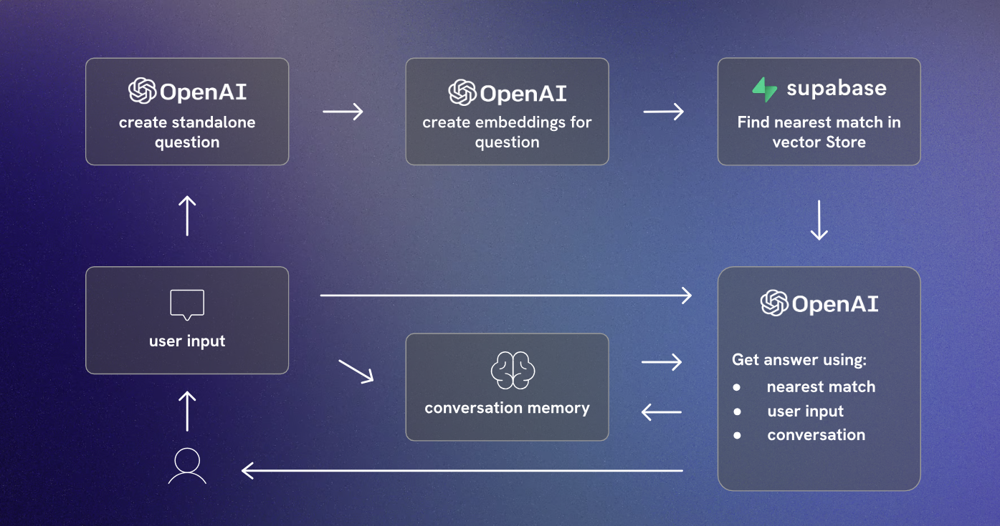
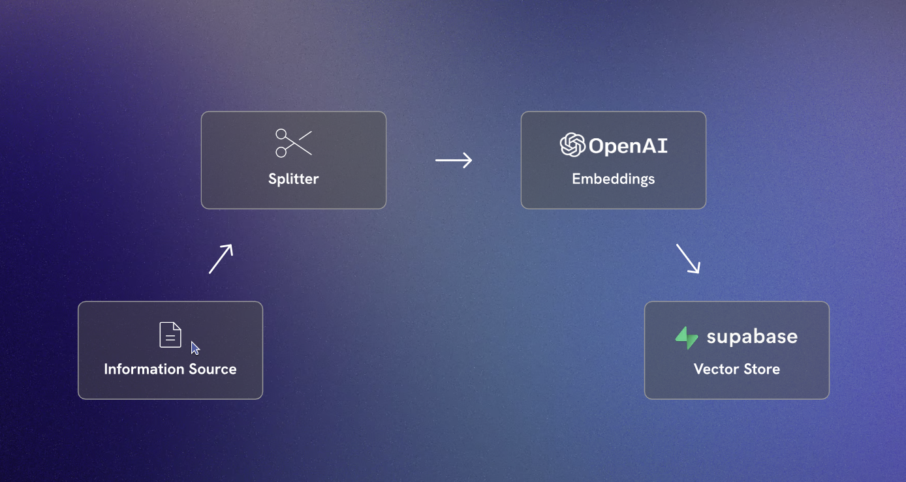

# Langchain Powered AI Chatbot (Scrimba Tutorial)

An LLM powered chatbot that can answer questions on based on your specific data.
This project is based on the [Scrimba Tutorial](https://v2.scrimba.com/the-official-langchainjs-course-c02t) by [Tom Chant](https://v2.scrimba.com/@DoubleNemesis).

#### App Flow



#### Knowledge Store



## Getting Started

### Prerequisites:

- Supabase Account
- Google AI Platform Account
- Run the query found in `match_documents.sql` in your Supabase database

### Install the dependencies:

```bash
yarn install
```

### Set the environment variables:

```bash
cp .env.example .env

# open .env and modify the environment variables
```

### Run the app

```bash
yarn start
```

## Improving Performance

- Update the chunk size and overlap size used by the text splitter
- Test different number of chunks retrived
- Prompt engineering
- Try different LLM settings based on your use case
